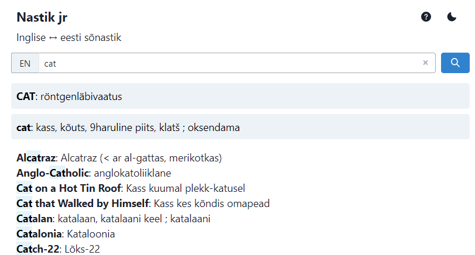
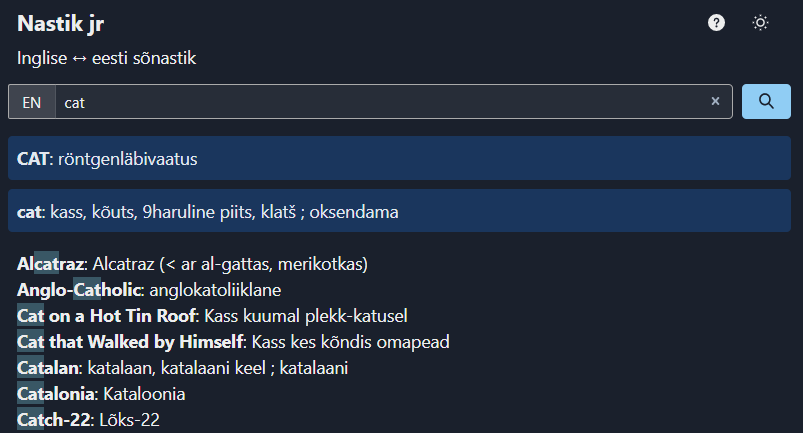

# Nastikjr-front-reactjs

Nastikjr-front-reactjs is Nastik Jr frontend.
Nastik Jr is English-Estonian dictionary, new version of an old [service](https://nastik.palat.ee/) from 2004.

Nastikjr-front-reactjs is written in React and contains only frontend code to retrieve data from API backend. Database and backend written in Java is available here.

Demo: http://nastik.eatmorepancakes.com/

There is light mode

... and dark mode



and it behaves in mobile too.


## Installing

For development you need [Node.js](https://nodejs.org/en/). Then run

```shell
npm i
```

This should install all the dependencies. Then 

```shell
npm start
```

to start development server at port 3000. Open http://localhost:3000 to see it working.
To build production version

```shell
npm build
```

Production build will be in /build, ready to be copied to webserver.

**NB!** Configuration assumes that build will be run froms server toot (nastikjr.awesomeserver.com). If that is not the case refer to [React documentation](https://create-react-app.dev/docs/deployment/#building-for-relative-paths).

## Connecting to API server

By default Nastikjr-react uses API demo api server at [eatmorepancakes.com](https://eatmorepancakes.com/). API server URL is configurable in src/config.json in case you host backend yourself.

